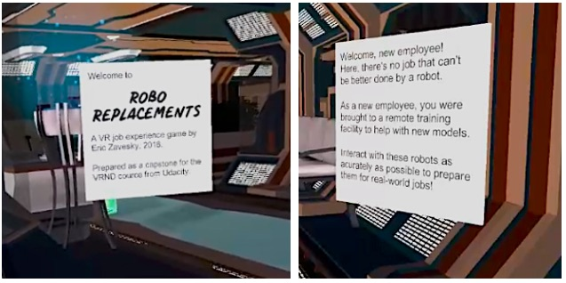
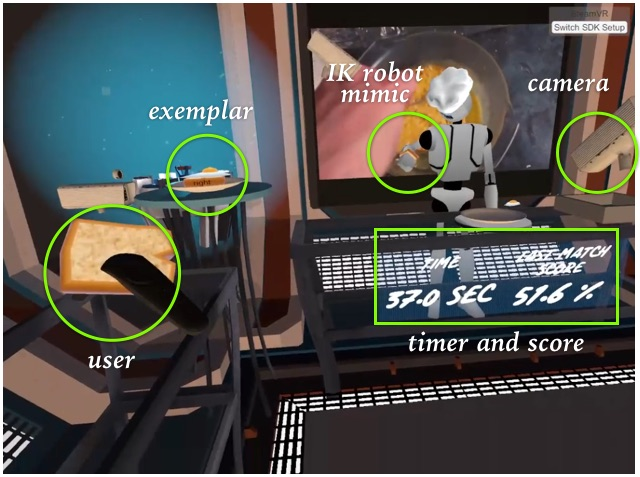
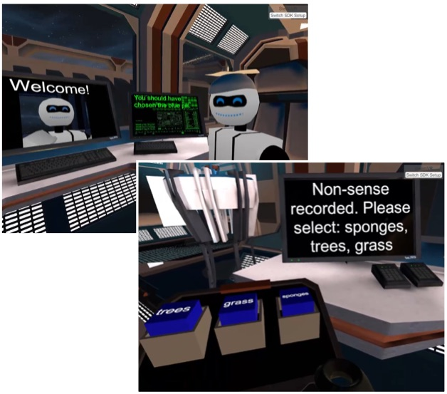
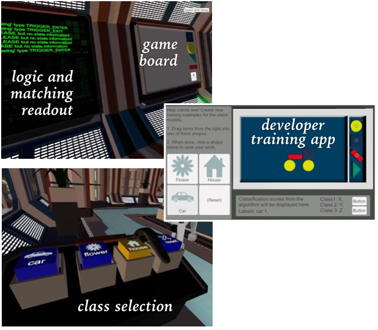

# Robo Replacements

This project is part of [Udacity](https://www.udacity.com "Udacity - Be in demand")'s [VR Developer Nanodegree](https://www.udacity.com/course/vr-developer-nanodegree--nd017).

## Design and Gameplay
Extensive design, testing, and scope tracking is documented in [design docs](docs/design.pdf).  

### Runtime
The application was designed and tested 
to run in both the Vive and Oculus environments.  By default, it will 
attempt to use the SteamVR framework, but you can switch the VR engine
by selecting other options in a combo-box in the top right.  This 
strategy (powered by the [VRTK engine](https://vrtoolkit.readme.io/)
even allows testing via keyboard with no VR engine at all.

A compiled version of the application is accessible in multi-part files
``build_robo_replacements_parts.zip``.  Standatd unzip software should correctly reassemble the 
files and unzip automatically.  Additionally, the supplemental learner
software (currently, it only collects samples) is included in the file
``build_learner3d.zip``.

### User Feedback
User feedback was sampled both for individual design elements as well as longer play sessions.  Check out the [design docs](docs/design.pdf) for more verbose logging and discussion.

### Future Revisions
* Use of computer vision in seeing task for matching visual objects; using 2D companion app to compose
* Additional gamification stickers/badges for competing in the different levels
* Possibly additional content within each game (more food combos, more stories to tell, more shapes), but initial user feedback did not cite this as a shortcoming.

## Walkthrough
Snapshots of the overall and individual levels are 
included below.  For more comprehensive discussions of each task and their design, please see
the [design docs](docs/design.pdf).

<table width="100%" >
<tr><td><strong>Introduction</strong> [<a href="https://youtu.be/Kobba1wtcrI" target="_new">YouTube video</a>]
<ul><li>Upon entry, the user is introduced to the fictional company of Robo Replacements.</li>
<li>The company has different task stations that the user must help with as a new employee.</li>
<li>This environment has basic user interactions that change the narrative of each robot task.</li></ul>
</td><td width="40%" >

</td></tr>

<tr><td><strong>Doing/Cooking</strong> [<a href="https://youtu.be/YjvpUNM3aP4" target="_new">YouTube video</a>]
<ul><li>The user must simulate a cooked item by stacking food parts in the same fashion as the exemplar.</li>
<li>A timer and 3D placement and rotation matching scores are averaged and shown for motivation.</li>
<li>For flare, cameras hover and the exemplar food rotates.</li>
<li>The robot mimics then user actions via IK tracking of an object that is moved to a similar position as the user's target object.</li>
<li>Objects are cloned for the robot side and given perfect position symmetry with relative parent position correspondence.</li>
<li>Using IK targeting actions, the robot appears to mimic the user and is captured via "cameras" as in a TV display.</li></ul>
</td><td>

</td></tr>

<tr><td><strong>Listening/Writing</strong> [<a href="https://youtu.be/-QmW1JUYp2c" target="_new">YouTube video</a>]
<ul><li>In the Listening and writing task, the robot prompts the user with a simple story to complete.  </li>
<li>Instead of a full MadLibs implementation, a small set of words was hand picked for the user to choose from.</li>
<li>Physics-based push buttons with dynamically populated text are the primary means for interaction.</li>
<li>During playback, graphics associated with each user-selected word in the story are displayed.</li>
<li>In code, stories are easily created and linked to key words via simple templated data structures.</li>
<li>At time of writing this walkthrough, the stories were not auto-read through a text-to-speech system, but this could be a further refinement. </li></ul>
</td><td>

</td></tr>

<tr><td><strong>Seeing/Learning</strong> [<a href="https://youtu.be/gugcc3nOjKk" target="_new">YouTube video</a>]
<ul><li>The seeing task lets the user create basic pictures with a few shape primitives and evaluate them against in-app machine learning.</li>
Unfortunately, timing prevented this task from being fully completed.  But some basic data was collected from a companion app and stored in the repo's /data directory.</li>
Proximal to the user's interaction was a logic and matching readout to help them understand what was happening in the algorithm itself. </li></ul>
</td><td>

</td></tr>

</table>

## Rubric Checks
* **Animation (100)** - animation was incorporated for different robot movements; while the quality and diversity will be improved, a starter for each station is in place; robots within the seen were animated both with look-based IK as well as motion/aniation triggers throughout the level
* **Lighting (100)** - where insuffficient with ambient lighting, real-time lamps were replicated and altered for hue; additioanlly, harnessing the directionality of the skybox a strong ambient light was created that has intersting shadow effects through windows.
* **Locomotion (100)** - locomotion uses a combination of open teleporting along a main path through the output with specific regions of interest denoted with differently colored waypoints that will turn the user towards the location of primary action
* **video (max 100)** - primarily used to motivate each task, background videos (open source) were opportunistically included; many static and moving image sources were utilized to enhance gameplay and lighten the mood; many custom objects were included
* **gamification (250)** - there are three mini-games within the space: one to teach (doing task), one to listen (speech recognition+ story reading task), one to challenge the AI (seeing task).  The user can repeat each of them for a diferent gaming experience.  Additionally, unique dialog entries are randomly chosen throughout the user's interactions with the robots.
* **Diegetic UI (250)** - where possible visuals and audio-based communication is given to the user; some text is still required, but attempts were made to condense them into short buttons (**non-text components are essential to gameplay**)
* **storyline (250)** - a lightweight dialog manager was hand-created with region triggers to start and end conversation with robots at different tasks; different conversations can be triggered for the same point using a coarse probabilty + random number selection
* **AI (250)** - a system for training and evaluating placement of blocks to guess visual patterns was implemented -- due to timing this was not hooked into the main VR experience -- instead, only a supplemental 2D learner application was created to help create training data for online models in the game; agin though the models were not completed. (**partially completed**)
* **speech recognition (500)** - speech recongition was investigated but it could not be hooked in for streaming in such a short amount of time (**not completed**)
* **user testing (250)** - user testing was accomplished in two ways, early and quick user testing of individual ideas and visual concepts during design and implementation; a secondary, more complete test was also performed when siginificant milestones (like the completion of a task station); notes were taken along the way in the primary design document  (**evaluation and improvements included**)

## Data Sources
Some assets were used from the open source community and are
documented below.

### Environment and objects
* [Asteroids package](https://assetstore.unity.com/packages/3d/props/asteroid-pack-by-pixel-make-83951)
* [Sci-Fi Environment](https://assetstore.unity.com/packages/3d/environments/sci-fi/sci-fi-styled-modular-pack-82913)
* [toon robot](https://assetstore.unity.com/packages/3d/characters/robots/sleek-toon-bot-free-34490)
    * [sitting and talking animations](https://assetstore.unity.com/packages/3d/animations/everyday-motion-pack-free-115067)
    * [simple animations](https://assetstore.unity.com/packages/templates/systems/ragdoll-and-transition-to-mecanim-38568)
* [space skybox](https://assetstore.unity.com/packages/2d/textures-materials/sky/skybox-volume-2-nebula-3392)
* [howto cooking video](https://www.flickr.com/photos/chegs/with/4743052401/)
* [comic panels font](https://www.dafont.com/comic-panels.font)
* [LeanTween package](https://assetstore.unity.com/packages/tools/animation/leantween-3595)
* [simple camera model](https://assetstore.unity.com/packages/3d/props/electronics/free-pbr-security-camera-70061)
* [food pack](https://assetstore.unity.com/packages/3d/props/food/free-food-pack-85884)
* [plate](https://free3d.com/3d-model/plate--81292.html)
* [chefs hat](https://www.models-resource.com/xbox_360/avatarmarketplace/model/18699/)
* [graduation hat](https://free3d.com/3d-model/graduation-hat-97228.html)

### Story Media
Specifically, in this section these (mostly image assets) were utilized for parts of the reading/listening task as background images that would be visualized on the robot's working terminal.

* [reading task screen saver](https://www.YouTube.com/watch?v=Fn44paKMX4E) derived from [this screen saver](https://www.screensaversplanet.com/screensavers/retro-sci-fi-522/)
* [training messages](https://www.pexels.com/photo/group-of-people-holding-message-boards-1059116/)
* [monkey in mirror](https://www.pexels.com/photo/closeup-photo-of-primate-1207875/)
* [tiger](https://www.pexels.com/photo/close-up-photography-of-tiger-792381/)
* [children](https://www.pexels.com/photo/girls-on-desk-looking-at-notebook-159823/)
* [cheetah](https://www.pexels.com/photo/cheetah-cat-feline-big-cat-16057/)
* [rainforest](https://www.pexels.com/photo/rainforest-during-foggy-day-975771/)
* [grassland](https://www.pexels.com/photo/blue-chalet-clouds-cottage-553575/)
* [Mars](https://www.pexels.com/photo/white-space-ship-and-brown-planet-586030/)
* [trees](https://www.pexels.com/photo/nature-forest-trees-park-38136/)
* [sponge](https://www.pexels.com/photo/washing-a-car-with-a-sponge-6003/)
* [eagle](https://www.pexels.com/photo/bald-eagle-over-the-body-of-water-732096/)
* [Jupiter](https://www.flickr.com/photos/c_a_palmer/6640551673/in/photolist-b7NyEe-aCseQJ-r1AyNU-sqkhNU-5UbJtp-9AnPd-23FPwYu-6JCRTs-54dSSu-6SFdb1-24MDGDZ-TBEgCp-Wc3Ehe-rbWe7E-aUb3qz-54dSSG-q9RdmZ-Fkydwy-KAfCx-FUHqRo-qSEMvs-azNJnr-CeNyRo-et4QPp-bxVXa-bFT5RV-7s2KBc-bqajHH-73pLoQ-6U74dm-jx7xso-j7ptAk-5TMgtQ-24DMPYX-phNDgW-V8V1Mo-ph8Rr5-n5ajPP-997Ty9-TuvR3s-2KdpBT-dJESCq-8nwDnk-6VCUac-m1fipX-bB3bAe-bGu6SB-pWGZzP-iBinzs-GD6vcE/)
* [phones](https://www.pexels.com/photo/silver-iphone-6-beside-a-space-gray-iphone-6-163096/)
* [kittens](https://www.pexels.com/photo/kitten-cat-rush-lucky-cat-45170/)
* [people](https://www.pexels.com/photo/people-brasil-guys-avpaulista-109919/)
* [pens](https://www.pexels.com/photo/arts-and-crafts-blur-creativity-design-261591/)
* [sleeping baby](https://www.pexels.com/photo/baby-sleeping-on-white-cotton-161709/)
* [pumpkin eater](https://www.pexels.com/photo/adult-autumn-biting-close-up-265316/)
* [India Taj](https://www.pexels.com/photo/ancient-architecture-asia-building-602607/)
* [beach](https://www.pexels.com/photo/dock-with-cottages-877962/)
* [idea bulb](https://www.pexels.com/photo/analysis-blackboard-board-bubble-355952/)
* [library](https://www.pexels.com/photo/full-length-of-man-sitting-on-floor-256431/)
* [scrabble](https://www.pexels.com/photo/alphabet-close-up-communication-conceptual-278887/)
* [robots](https://www.pexels.com/photo/wall-e-die-cast-model-981588/)
* [dog driving](https://www.pexels.com/photo/adorable-adult-animal-automotive-236452/)
* [boxing](https://www.pexels.com/photo/man-couple-people-woman-343/)
* [ice cream](https://www.pexels.com/photo/woman-dropped-fail-failure-4091/)
* [stream light hoodie](https://www.pexels.com/photo/photography-of-person-wearing-hoodie-jacket-590701/)
* [tooth brush](https://www.pexels.com/photo/clean-mouth-teeth-dentist-40798/)

### Versions
* Unity 2017.2.0f3
* Tested on Oculus RIFT and HTC Vive
* Leverages VRTK 3.3 for controller normalization (and testing) in Unity

